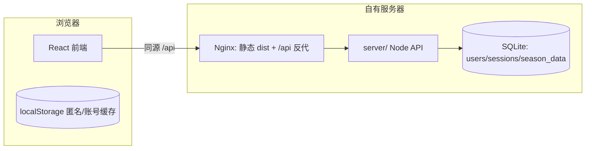

# 《捕捉计数器》账号登录与按账号多端同步设计规格

> 来源：2026-08-11 与用户的方案讨论（方案 A：自建后端）。
> 状态：已核对当前 `master` 代码（`src/domain/sync.ts`、`storage.ts`、`types.ts`、`App.tsx`、`DataManager.tsx`、`.github/workflows/deploy.yml`）。本规格是实施计划的输入，落盘为 `docs/superpowers/plans/2026-08-11-account-sync.md`。

## 1. 目标

- **R1（账号）**：注册 / 登录 / 登出。用户名 + 密码，无邮箱。数据按账号在服务器上隔离存储。
- **R2（账号同步）**：登录后进入账号模式，多设备同步不再需要 GitHub Token / Gist ID；沿用启动自动拉取 + 变更后 debounce 自动上传的节奏。
- **R3（原样保留）**：匿名本地模式（不登录照常使用）与 GitHub Gist 同步全部保留；登录时 GitHub 配置区折叠，登出后恢复。
- **R4（迁移）**：首次登录时处理匿名本机数据与账号云端数据的关系（上传本机 / 采用云端），不丢数据。

## 2. 决策记录（已与用户确认）

| 决策点 | 结论 |
| --- | --- |
| 后端形态 | 自建小 API 服务，Node + TypeScript，同仓库新增 `server/` 目录，与前端共享 `AppData` 类型 |
| 用户规模 | 熟人圈子（几十人内） |
| 注册方式 | 完全开放注册（用户名+密码）；登录/注册按 IP 限流防滥用 |
| 找回密码 | 管理员重置（`is_admin` 用户调用 API），无邮件系统 |
| 登录入口 | 顶部栏右侧主入口 + 「数据管理与多端同步」模块内次入口，双入口指向同一对话框 |
| 登录后界面 | 用户名徽标 + 登出；管理员额外有「重置密码…」；GitHub 配置区折叠 |
| 冲突策略 | LWW：服务器时间戳 `updated_at` 为准；「上传本机数据」「拉取云端数据」手动按钮保留 |
| 数据存储 | SQLite `season_data` 表，每账号每赛季一行，值即整个 `AppData` JSON，数据结构零迁移 |
| 会话 | 随机 token + httpOnly cookie（SameSite=Lax + Secure），token 哈希后存 `sessions` 表 |

## 3. 范围边界（明确不做）

| 不做 | 理由 |
| --- | --- |
| 邮箱验证、密码找回邮件、验证码、第三方 OAuth（Google/GitHub/微信） | 熟人圈子；开放注册已确认；限流足以防滥用 |
| 多设备并发编辑的自动合并 | LWW 已够；现有 `mergeAppData` 逻辑保留但不在账号模式下启用 |
| 独立的 Web 管理后台页面 | 管理员能力并入登录菜单的下拉项 |
| 修改 `AppData` 结构、赛季隔离、导入/导出、主题 | 与账号功能无关 |
| 删除或重构现有 GitHub Gist 同步 | R3 要求原样保留（`sync.ts` 中 `pullFromGist/pushToGist` 及其 UI 均不动） |
| `updatedAt` 语义改动（v0.4.0 的本地 `lastModifiedAt`） | 设备本地时间不可跨设备比较，仅作展示；账号模式以服务器时间为准 |

## 4. 架构



- 现有部署（GitHub Actions rsync 静态文件到 SSH 服务器）不变；新增一个部署后端进程的 job。
- 同源部署，无 CORS。

## 5. 数据模型（SQLite，`server/db.sqlite`）

```sql
CREATE TABLE users (
  id            INTEGER PRIMARY KEY AUTOINCREMENT,
  username      TEXT NOT NULL UNIQUE,
  password_hash TEXT NOT NULL,
  is_admin      INTEGER NOT NULL DEFAULT 0,
  created_at    TEXT NOT NULL
);

CREATE TABLE sessions (
  token_hash TEXT PRIMARY KEY,
  user_id    INTEGER NOT NULL REFERENCES users(id),
  created_at TEXT NOT NULL,
  expires_at TEXT NOT NULL
);

CREATE TABLE season_data (
  user_id    INTEGER NOT NULL REFERENCES users(id),
  season_id  TEXT NOT NULL,
  data_json  TEXT NOT NULL,
  updated_at TEXT NOT NULL,   -- 服务器时钟 ISO 字符串，权威
  revision   INTEGER NOT NULL DEFAULT 1
);
```

- `season_data` 主键 `(user_id, season_id)`，S2/S3 各一行；查询永远带 `WHERE user_id = ?`，账号间天然隔离。
- `data_json` 就是现有 `AppData` 序列化，复用 `migrateAppData` 防御性校验（服务端可选）。
- 会话有效期 30 天，过期即删。

## 6. API 设计（`server/`，约 7 个端点）

| 方法 | 路径 | 说明 |
| --- | --- | --- |
| POST | `/api/register` | `{username, password}`；用户名 2–32 字符，密码 ≥ 8 字符；限流 |
| POST | `/api/login` | `{username, password}`；成功设置会话 cookie |
| POST | `/api/logout` | 删除当前会话 |
| GET | `/api/me` | 返回 `{username, isAdmin}` 或 401 |
| GET | `/api/data/:season` | 返回 `{data, updatedAt, revision}`；需登录 |
| PUT | `/api/data/:season` | 全量覆盖，服务端盖 `updated_at`/`revision+1`；需登录 |
| POST | `/api/admin/reset-password` | `{username, newPassword}`；仅 `is_admin` |

约定：

- 错误统一 `{error: string}` + 恰当 HTTP 状态码（400/401/403/429/500）。
- `register/login` 按 IP 限流（如 5 次/分钟），防爆破与机器人注册。
- 静态文件仍由 Nginx 直接服务，API 只处理 `/api/*`。
- 技术栈：Node 原生 `http` 或轻框架（Hono/Express 二选一，实施时定，倾向极简）+ `better-sqlite3` + `bcryptjs`。

## 7. 同步语义（账号模式）

- **权威**：`season_data.updated_at`（服务器时间）。`PUT` 时服务器盖时间戳，不信任设备时钟。
- **启动时**：若云端 `updated_at` 新于本机记录的「上次同步到云端的时间」→ 自动拉取；否则不动作（避免打开即闪烁）。
- **变更后**：沿用现有 800ms debounce 自动上传逻辑，上传成功后把服务器返回的 `updatedAt` 记到本地。
- **手动**：「上传本机数据」「拉取云端数据」保留，行为=强制 `PUT` / 强制 `GET`。
- **冲突**：LWW，最后修改者赢；不做字段级合并。
- 匿名模式与 GitHub 模式：完全维持现状，本规格不改。

## 8. 前端改动清单

| 项 | 内容 |
| --- | --- |
| 存储命名空间 | 匿名：现有 key `s2-capture-counter:data` / `s3-capture-counter:data` 原样；登录后：`s2-capture-counter:<userId>:data` / S3 同理。两套并存，登出恢复匿名视图 |
| 登录对话框 | 注册/登录一体表单；顶部栏右侧按钮（未登录显示「登录 / 注册」，登录后显示用户名徽标 + 下拉：退出登录、管理员「重置密码…」）；数据管理模块同步区顶部放同一样式的次入口 |
| 会话持久化 | `fetch` 带 `credentials: "same-origin"`；页面刷新后调 `GET /api/me` 恢复会话 |
| 云端时间戳 | 本地存 `lastServerUpdatedAt`（按赛季），供启动比较 |
| 首次登录迁移向导 | 云端空 + 本机有匿名数据 → 问「上传本机数据到账号」（推荐）或「弃用本机数据」；两边都有 → 问用哪边（默认提示按时间比较） |
| 同步适配 | 新增 `src/domain/serverSync.ts`：`pullFromServer/pushToServer`，返回形状与 `SyncResult` 一致；App.tsx 现有 hydration/debounce/`skipNextAutoUploadRef` 等逻辑复用，仅在登录态走 server 路径 |
| GitHub 折叠 | 登录后 `DataManager` 的 GitHub Token/Gist 配置区折叠（配置保留），登出恢复 |

## 9. 部署与运维

- `server/` 独立构建（`tsc` 或 esbuild），产物 rsync 到服务器（`deploy.yml` 新增 job，步骤顺序在静态站之后）。
- systemd unit `counter-api.service`（`Restart=on-failure`），`WorkingDirectory=~/counter-api`，数据与备份放 `~/counter-data/`。
- Nginx：`location /api { proxy_pass http://127.0.0.1:<port>; }`，静态站照旧。
- 首次上线一次性设置：创建 systemd unit、nginx 片段、SQLite 数据库文件、crontab 每日备份（`sqlite3 .backup` 或直接拷贝 `.db`）。
- 本地开发：Vite `server.proxy` 把 `/api` 代理到本地端口，`npm run dev` 同时跑前端与 `node server`。

## 10. 安全

- 密码 `bcryptjs`，cost 10。
- 会话 token 随机 32 字节，`sessions` 只存 SHA-256 哈希。
- cookie：`HttpOnly` + `SameSite=Lax` + `Secure`（HTTPS 下）。
- SQL 全部参数化（`better-sqlite3` prepared statements）。
- `register/login` IP 限流 429。
- 管理员重置密码只改哈希，不输出明文。

## 11. 测试与验证

- `server/`：vitest 端到端（内存 SQLite）：注册→登录→读写数据往返→登出→未登录 401→非管理员 403→限流 429→用户名冲突 400。
- 前端：现有 `App.test.tsx` 适配（新增登录态测试：命名空间切换、双入口、登出恢复匿名视图、迁移向导两种分支）。
- 最终验证：`npm test` 与 `npm run build` 全绿；本地起前端 + server 手动冒烟（登录→计数→刷新→拉取→另一浏览器标签验证账号隔离）。

## 12. 工作量预估（实施计划输入）

- `server/`：`db.ts`、`auth.ts`、`routes.ts`、`index.ts`、`server.test.ts`，约 400–600 行。
- 前端：`src/domain/serverSync.ts`、`src/components/LoginDialog.tsx`（含管理员重置）、命名空间改造、迁移向导、`DataManager`/顶部栏接线。
- 依赖新增：`better-sqlite3`、`bcryptjs`（server）；前端无新运行时依赖。
- 不改：`sync.ts`（Gist 路径）、数据结构、赛季隔离、导入导出、主题。